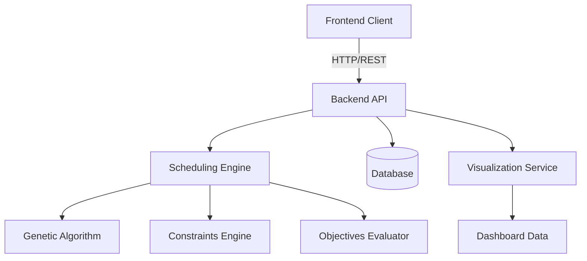

# Architecture Documentation

This section provides a comprehensive overview of the Gym Class Rotation Scheduler's architecture, design principles, and technical decisions.

## Overview

The architecture documentation covers:

- [System Overview](system-overview.md) - High-level architecture and key components
- [Backend Architecture](backend-architecture.md) - Server-side components and design
- [Frontend Architecture](frontend-architecture.md) - Client-side structure and patterns
- [API Design](api-design.md) - API contracts and integration points
- [Data Models](data-models.md) - Core domain models and data structures

## Architecture Diagram

## Design Principles

The architecture follows these core principles:

1. **Separation of Concerns**: Clear boundaries between components
2. **Domain-Driven Design**: Models reflect the scheduling domain
3. **RESTful API**: Consistent API design for client-server communication
4. **Modularity**: Components can be developed and tested independently
5. **Extensibility**: Easy to add new constraints, objectives, or solvers

## Technology Stack

- **Frontend**: React, TypeScript, Zustand
- **Backend**: Python, FastAPI
- **Scheduling Engine**: Custom genetic algorithm implementation
- **Build/Deploy**: Docker, npm
