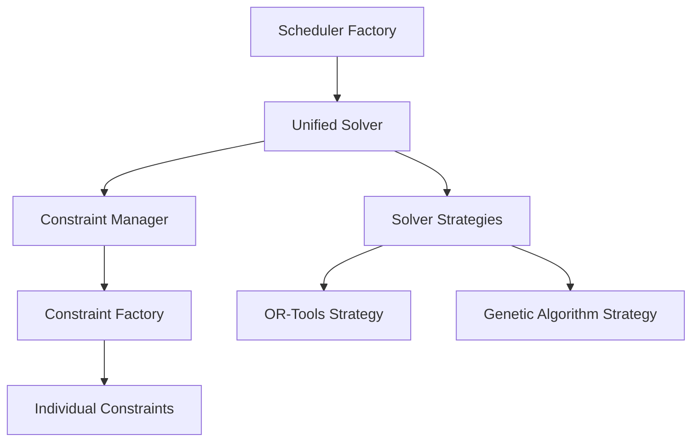

# Backend Components

This section provides detailed documentation on the backend components of the Gym Class Rotation Scheduler project.

## Core Components

The backend system consists of several key components:

| Component | Description | Documentation |
|-----------|-------------|---------------|
| Scheduler | The main scheduling component responsible for creating and managing schedules | [Scheduler Documentation](scheduler.md) |
| Constraint System | System for defining and enforcing scheduling rules and constraints | [Constraints Documentation](constraints.md) |
| Genetic Algorithm | Implementation of genetic algorithms for optimization | [Genetic Algorithm Documentation](genetic-algorithm.md) |

## Architecture

The backend components are designed with a focus on:

1. **Modularity** - Components are designed to be self-contained and independently testable
2. **Extensibility** - Easy to add new constraints, solvers, and optimization strategies
3. **Performance** - Optimized for handling complex scheduling problems efficiently

## Integration

These components work together to provide the core functionality of the scheduling system:

## Recent Enhancements

Recent enhancements to the backend components include:

- Enhanced constraint system with auto-registration and improved validation
- Refactoring of the UnifiedSolver using the Strategy pattern
- Improved configuration management with builder pattern
- Better dependency injection with consistent container usage
