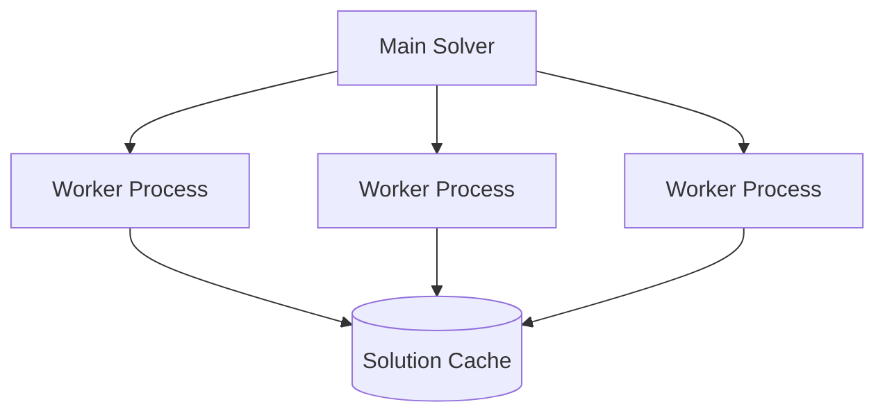

# Phase 3: Parallel Solving Architecture

## Worker Design


## Key Components
1. **Worker Processes**
```python
class SolverWorker:
    def __init__(self, config):
        self.config = config
        self.cache = SolutionCache()
        
    def run(self, problem):
        """Solve problem with caching"""
        cached = self.cache.check(problem)
        if cached:
            return cached
        return self._solve(problem)
```

2. **Cache System**
- SHA-256 hash-based solution lookup
- LRU cache eviction policy
- Similarity scoring for partial matches

## Performance Targets
- 2x speedup on 4-core systems
- Linear scaling up to 16 cores
- 40% cache hit rate minimum

## Implementation Steps
1. Create worker pool management
2. Implement inter-process communication
3. Develop cache storage backend
4. Add resource monitoring
