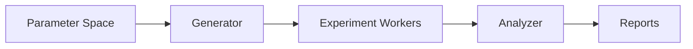

# Phase 4: Experimentation Framework

## Parameter Search System


## Version Control
```python
class ExperimentVersion:
    def __init__(self, params):
        self.params = params
        self.hash = self._generate_hash()
        
    def _generate_hash(self):
        """SHA-1 hash of parameter JSON"""
        return hashlib.sha1(
            json.dumps(self.params).encode()
        ).hexdigest()[:8]
```

## Implementation Steps
1. Create parameter space definition format
2. Build automated experiment runner
3. Implement versioned result storage
4. Develop analysis toolkit

## Validation Criteria
- 100% experiment reproducibility
- Automated regression detection
- Clear version migration paths
- Parameter impact scoring
