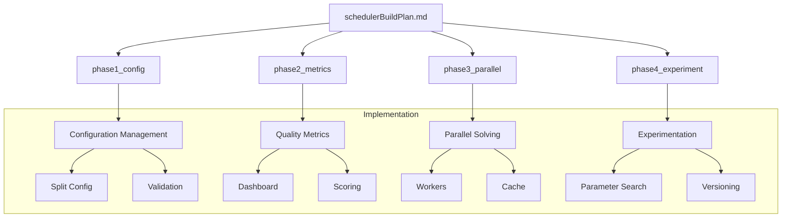
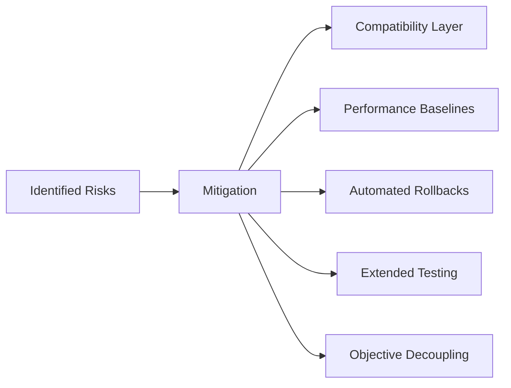

# Scheduler Architecture Improvement Plan

## Phase Documentation Structure


## Phase 1: Configuration Management
Document: [phase1_config.md](memory-bank/implementationPhases/phase1_config.md)
- Split monolithic config.py
- Create validation system covering:
  - Objective interaction checks
  - Weight boundary validation
  - Priority inversion prevention
- Dynamic weight adjustment API
- Backwards compatibility layer

## Phase 1 Addendum: Dynamic Configuration


## Phase 2: Metrics-Driven Optimization  
Document: [phase2_metrics.md](memory-bank/implementationPhases/phase2_metrics.md)
- Quality metrics framework
- Automated scoring system
- Historical performance tracking
- Dashboard implementation

## Phase 3: Parallel Solving Architecture
Document: [phase3_parallel.md](memory-bank/implementationPhases/phase3_parallel.md)
- Worker process design
- Solution cache system
- Similarity scoring
- Resource management

## Phase 4: Experimentation Framework
Document: [phase4_experiment.md](memory-bank/implementationPhases/phase4_experiment.md)
- Parameter search implementation
- Version control system
- Automated experiment tracking
- Regression testing integration

## Timeline
```gantt
gantt
    title Scheduler Improvement Timeline
    dateFormat  YYYY-MM-DD
    section Documentation
    Phase 1 Docs     :done, des1, 2025-02-11, 1d
    Phase 2 Docs     :active, des2, 2025-02-12, 1d
    Phase 3 Docs     :         des3, 2025-02-13, 1d
    Phase 4 Docs     :         des4, 2025-02-14, 1d
    section Implementation
    Config Changes   :         crit, 2025-02-15, 3d
    Metrics System   :         crit, 2025-02-18, 5d
    Parallel Solver  :         crit, 2025-02-23, 5d
    Experimentation  :         crit, 2025-02-28, 7d
```

## Risk Management


## Testing Strategy
| Phase       | Test Type          | Tools               | Success Criteria          |
|-------------|--------------------|---------------------|---------------------------|
| Config      | Integration        | pytest, hypothesis  | 100% backwards compatibility |
| Metrics     | Validation         | pandas, numpy       | ≥90% metric accuracy      |
| Parallel    | Performance        | pytest-benchmark    | 2x speed improvement       |
| Experiment  | E2E                | Jupyter, matplotlib | Reproducible results      |
