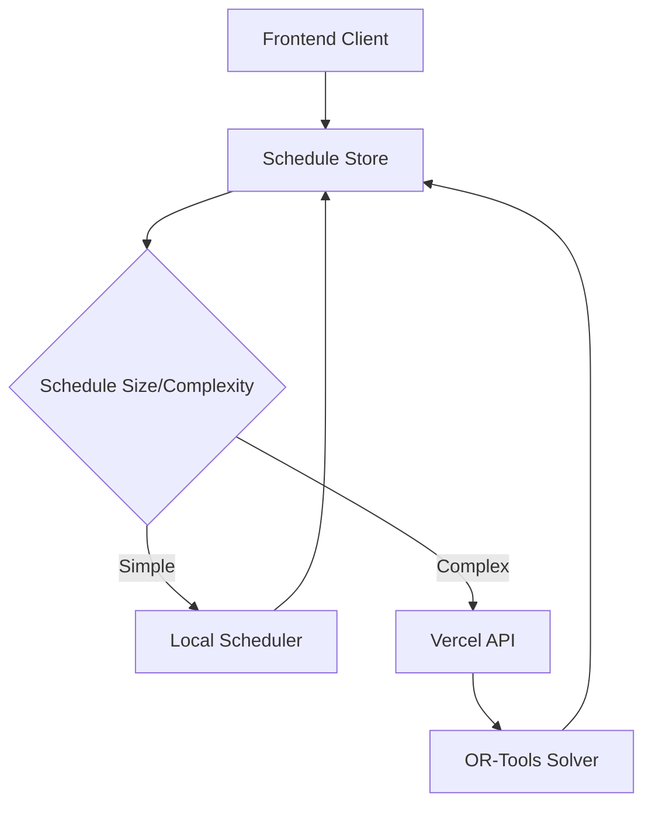

# Serverless Integration Plan

## Overview
Implementation plan for adding OR-Tools-based serverless scheduling functionality via Vercel, creating a hybrid approach that combines local and remote scheduling capabilities.

## Architecture


## Implementation Phases

### Phase 1: Serverless Infrastructure Setup
1. Initialize Vercel Project
   - Configure project settings
   - Set up environment variables
   - Configure build settings

2. Create API Structure
```
api/
├── schedule/
│   └── route.ts       # Main scheduling endpoint
├── lib/
│   ├── or-tools.ts    # OR-Tools wrapper
│   ├── scheduler.ts   # Core scheduling logic
│   └── types.ts       # Shared types
└── package.json       # Backend dependencies
```

3. Set up OR-Tools
   - Install OR-Tools package
   - Create wrapper for constraint programming solver
   - Implement basic scheduling functionality

### Phase 2: Core Algorithm Implementation
1. Convert Constraints to OR-Tools Format
   - Map hard constraints to CP-SAT constraints
   - Implement objective functions for soft constraints
   - Set up optimization goals

2. Implement Scheduling Logic
   - Create variables for time slots
   - Define constraint satisfaction rules
   - Implement optimization objectives
   - Add solution validation

3. Create API Interface
   - Define request/response types
   - Implement error handling
   - Add input validation
   - Set up response streaming

### Phase 3: Frontend Integration
1. Create API Client
```typescript
interface ScheduleRequest {
  classes: Class[];
  teacherAvailability: TeacherAvailability[];
  constraints: ScheduleConstraints;
}

interface ScheduleResponse {
  assignments: ScheduleAssignment[];
  metadata: {
    solver: 'or-tools' | 'backtracking';
    duration: number;
    score: number;
  }
}
```

2. Modify Schedule Store
   - Add API integration
   - Implement hybrid scheduling strategy
   - Add loading states
   - Handle errors

3. Update UI Components
   - Add loading indicators
   - Enhance error displays
   - Show solver metadata
   - Add retry mechanisms

### Phase 4: Hybrid Strategy Implementation
1. Decision Logic
```typescript
const shouldUseServerless = (params: ScheduleParams): boolean => {
  return (
    params.classes.length > 10 ||           // Large dataset
    hasComplexConstraints(params) ||        // Complex constraints
    requiresAdvancedOptimization(params)    // Need better optimization
  );
};
```

2. Fallback Mechanism
   - Keep local scheduler as backup
   - Implement automatic fallback on failure
   - Add manual override option

3. Performance Optimization
   - Implement request caching
   - Add response streaming
   - Optimize data transfer

### Phase 5: Testing & Deployment
1. Testing Strategy
   - Unit tests for OR-Tools integration
   - API endpoint testing
   - Integration tests
   - Performance benchmarks

2. Deployment Process
   - Set up CI/CD pipeline
   - Configure monitoring
   - Add error tracking
   - Set up logging

3. Documentation
   - API documentation
   - Usage examples
   - Error handling guide
   - Performance considerations

## Success Criteria
1. Successful generation of schedules using OR-Tools
2. Improved optimization for complex schedules
3. Seamless fallback to local scheduler when appropriate
4. Performance improvements for large datasets
5. Comprehensive error handling and recovery

## Dependencies
1. Vercel account and configuration
2. OR-Tools package
3. TypeScript types sharing between frontend/backend
4. Testing infrastructure
5. Monitoring tools

## Risks and Mitigations
1. Risk: OR-Tools performance issues
   - Mitigation: Extensive testing with various dataset sizes
   - Fallback to local scheduler when needed

2. Risk: API reliability
   - Mitigation: Robust error handling
   - Automatic retry mechanisms
   - Local scheduler fallback

3. Risk: Data synchronization
   - Mitigation: Clear state management
   - Optimistic updates
   - Conflict resolution strategies

4. Risk: Development complexity
   - Mitigation: Phased approach
   - Comprehensive documentation
   - Clear separation of concerns
