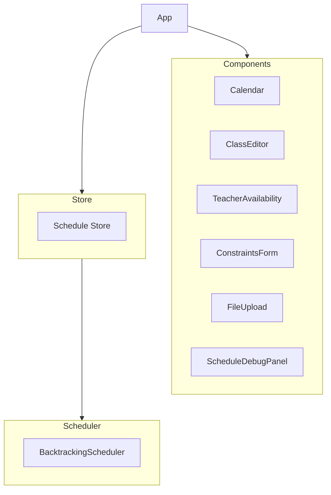

# System Patterns: Gym Class Rotation Scheduler

## Architecture Overview

### Frontend Architecture


## Core Design Patterns

### 1. State Management
- **Pattern**: Centralized store using Zustand
- **Implementation**: `scheduleStore.ts`
- **Purpose**: Manage application state, schedule generation, and data persistence
- **Benefits**: Simplified state updates, predictable data flow

### 2. Scheduling Algorithm
- **Pattern**: Backtracking with constraint satisfaction
- **Implementation**: `BacktrackingScheduler` class
- **Key Features**:
  - Performance optimization through caching
  - Preference-based slot scoring
  - Comprehensive constraint validation
  - Progress tracking

### 3. Component Architecture
- **Pattern**: Functional components with hooks
- **Structure**:
  ```
  src/
  ├── components/    # UI components
  ├── lib/          # Core business logic
  ├── store/        # State management
  └── types/        # TypeScript definitions
  ```

### 4. Data Models
- **Pattern**: TypeScript interfaces for type safety
- **Core Types**:
  - TimeSlot
  - WeeklySchedule
  - Class
  - TeacherAvailability
  - ScheduleAssignment
  - ScheduleConstraints

## Technical Decisions

### 1. Framework Selection
- **React**: Component-based UI development
- **TypeScript**: Type safety and developer experience
- **Vite**: Fast development and build tooling
- **Tailwind**: Utility-first styling

### 2. State Management
- **Choice**: Zustand over Redux/MobX
- **Rationale**: 
  - Simpler API
  - Built-in TypeScript support
  - Minimal boilerplate
  - Good performance

### 3. Scheduling Implementation
- **Approach**: Backtracking algorithm
- **Benefits**:
  - Handles complex constraints
  - Optimizes for preferences
  - Provides progress feedback
  - Supports validation

### 4. Data Validation
- **Strategy**: Multi-level validation
  - Type checking with TypeScript
  - Runtime constraint validation
  - Schedule verification
  - User input validation

## Performance Patterns

### 1. Caching
- Valid time slot caching
- Daily/weekly assignment count tracking
- Date string memoization

### 2. Optimization Strategies
- Class ordering by constraint complexity
- Randomized slot selection
- Progress tracking with throttling
- Early constraint validation

## Error Handling
- Comprehensive error messages
- User-friendly error display
- Detailed validation feedback
- Debug panel for troubleshooting
