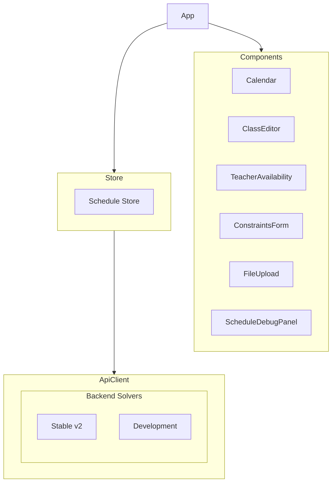

# System Patterns: Gym Class Rotation Scheduler

## Architecture Overview

### Frontend Architecture


## Core Design Patterns

### 1. State Management
- **Pattern**: Centralized store using Zustand
- **Implementation**: `scheduleStore.ts`
- **Purpose**: Manage application state, schedule generation, and data persistence
- **Benefits**: Simplified state updates, predictable data flow

### 2. Development Workflow
- **Pattern**: Two-Version Development
- **Implementation**: 
  - Stable Version: `solvers/stable.py`
  - Development Version: `solvers/dev.py`
  - Shared Config: `solvers/config.py`
- **Key Features**:
  - Solution quality experimentation
  - Search strategy testing
  - Standardized configuration
  - Performance monitoring

### 3. Configuration Management
- **Pattern**: Centralized solver configuration
- **Implementation**: `solvers/config.py`
- **Key Features**:
  - Shared constraint definitions
  - Standard objective weights
  - Consistent priority hierarchy
  - Single source of truth for solver settings
- **Benefits**:
  - Simplified maintenance
  - Consistent behavior
  - Easy experimentation
  - Clear configuration documentation

### 4. Scheduling Algorithm
- **Pattern**: CP-SAT solver with optimized search
- **Implementation**: OR-Tools CP-SAT
- **Key Features**:
  - Pre-filtered variable creation
  - Search strategy optimization
  - Quality-focused objectives
  - Multi-objective balancing
  - Performance monitoring
  - Comprehensive validation

### 5. Component Architecture
- **Pattern**: Functional components with hooks
- **Structure**:
  ```
  scheduler-backend/
  ├── app/
  │   ├── scheduling/
  │   │   ├── constraints/    # Scheduling constraints
  │   │   ├── objectives/     # Optimization objectives
  │   │   ├── solvers/       # Solver implementations
  │   │   │   ├── config.py  # Shared configuration
  │   │   │   ├── stable.py  # Stable solver
  │   │   │   └── dev.py     # Development solver
  │   │   └── utils/         # Shared utilities
  │   └── models.py          # Data models
  ```

### 6. Data Models
- **Pattern**: TypeScript interfaces and Python dataclasses
- **Core Types**:
  - TimeSlot
  - WeeklySchedule
  - Class
  - TeacherAvailability
  - ScheduleAssignment
  - ScheduleConstraints
  - SchedulerContext

## Technical Decisions

### 1. Variable Creation Strategy
- **Pattern**: Pre-filtered variable creation
- **Implementation**:
  - Only create variables for valid periods
  - Filter out conflicting periods early
  - Reduce search space significantly
  - Track variable creation in debug info

### 2. Priority System (from config.py)
- **Pattern**: Hierarchical weights
- **Implementation**:
  1. Required periods (10000) - Highest priority
  2. Early scheduling (5000) - High priority
  3. Preferred periods (1000 × weight) - Medium priority
  4. Avoided periods (-500 × weight) - Penalty
  5. Distribution (500) - Balance schedule
  6. Earlier dates (10) - Slight preference

### 3. Search Strategy
- **Pattern**: Quality-focused search
- **Implementation**:
  - Alternative search heuristics
  - Solver parameter tuning
  - Solution pattern analysis
  - Quality metrics tracking

### 4. Data Sharing
- **Pattern**: Context-based communication
- **Implementation**:
  - SchedulerContext for shared state
  - debug_info for cross-component data
  - Quality metrics tracking
  - Enhanced logging capabilities

## Performance Patterns

### 1. Search Space Optimization
- Pre-filtered variable creation
- Quality-focused search strategies
- Solution pattern analysis
- Efficient constraint application

### 2. Development Strategies
- Solution quality experiments
- A/B testing changes
- Quality metrics tracking
- Pattern documentation

## Error Handling
- Detailed variable creation logs
- Constraint validation feedback
- Quality metric monitoring
- Performance tracking metrics

## Testing Strategy
- Solution quality verification
- Search strategy validation
- Quality metrics tracking
- Performance benchmarking
